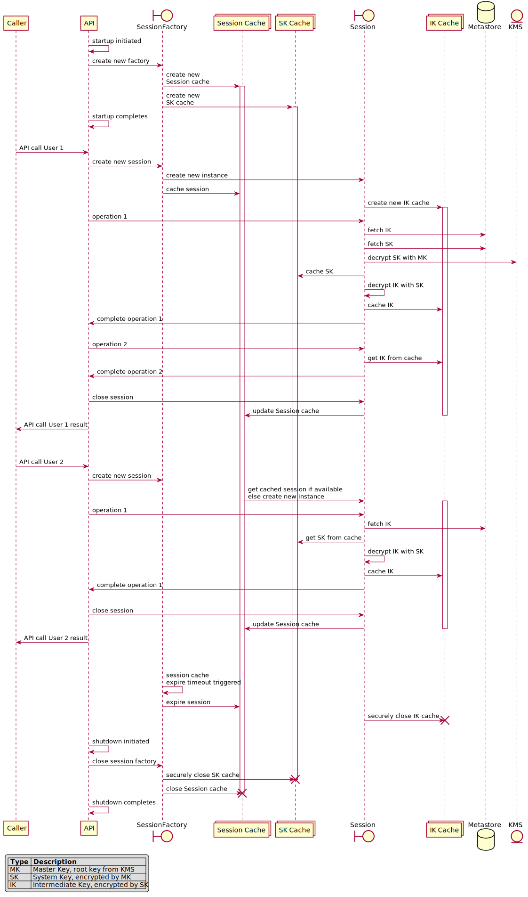

# Key Caching

Asherah supports caching of Intermediate and System Keys to minimize calls against external resource and reducing
latency. This is especially important for minimizing calls to the configured
[Key Management Service](KeyManagementService.md) as that is often the most expensive and latent interaction of the
resources involved. The cache is built on top of the Secure Memory implementation. 
For stateless workloads, when the calling app can't make use of the shared session, Asherah also provides the option
of caching Sessions. This further helps in reducing the latency by minimizing the number of API calls to the metastore
as the SDK makes use of the cached session instead of creating a new one. 

## Crypto Policy Configuration

The [Crypto Policy](CryptoPolicy.md) can be used to enable or disable the caching of the keys and session. Since keys
can be flagged as "revoked" before their expiration period (i.e. irregular key rotation), the status of a cached key 
is periodically retrieved from the Metastore. This "Revoke Check" period is configured using the
[Crypto Policy](CryptoPolicy.md)'s `revokeCheckPeriodMillis`. The
[Basic Expiring Crypto Policy](CryptoPolicy.md#basic-expiring-crypto-policy) provided by the library simplifies this to
the granularity of a minute with `revokeCheckMinutes()` in the builder.

## Cache Lifecycles

Due to the [hierarchical ordering](DesignAndArchitecture.md#key-hierarchy-and-storage) of the System and Intermediate
Keys, the scope of the their respective caches are different. For System Keys, which are intended to be service-level
keys, their lifetime is that of the `SessionFactory`. Ideally an instance of `SessionFactory`
is a singleton, where its lifetime is that of the application. This allows for the System Key cache to be shared
across `Session` instances generated from the session factory. Doing so prevents each one of these "encryption
sessions" from having to cache another copy of the same System Key in Secure Memory, as well as avoiding interaction
with the [Key Management Service](KeyManagementService.md) to decrypt it.

The cache for Intermediate Keys is scoped to the current partition's `Session` instance/session. This session has its
lifecycle maintained by the Session cache, which is configured by the [Crypto Policy](CryptoPolicy.md). Sharing the
Intermediate Key caches across sessions would incur less security posture as the blast radius would be widened if an
attacker somehow managed to hijack an application's session.

For a real-world example, consider an API request made from a web application with a logged-in user. When the request
is received, an encryption session will be created from the session factory with that user as the defining partition.
The first attempt at accessing encrypted data for that user will retrieve the Intermediate Key used for that Data Row
Key's encryption key. That Intermediate Key will be decrypted by the System Key, which would most likely be retrieved
from the System Key cache that is shared across other encryption sessions. The Intermediate Key would then be decrypted
and cached for the lifetime of that encryption session, which is likely the lifetime of that API request.

Below is a sequence diagram to help visualize the cache lifecycles (note DRK/DRR operations removed for simplicity):

